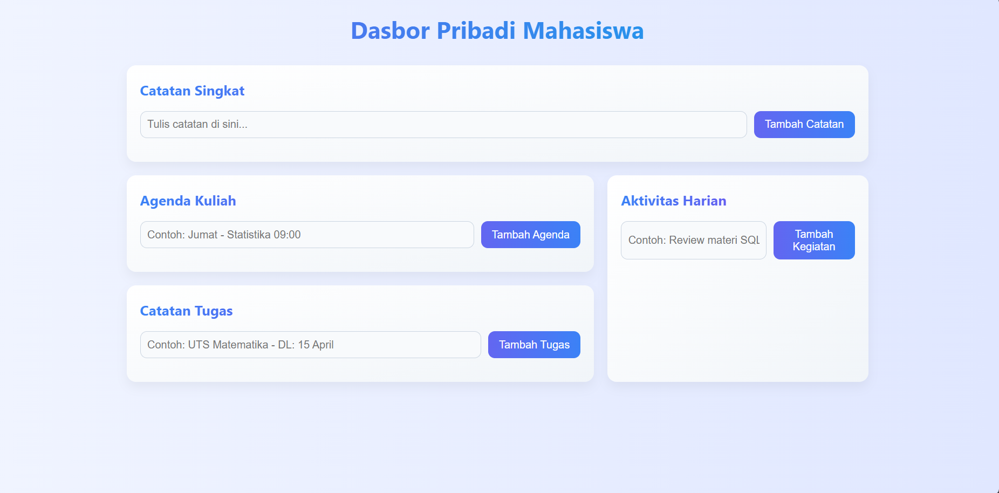

# 🧠 Personal Dashboard

**Personal Dashboard** adalah aplikasi berbasis web yang dirancang untuk membantu mahasiswa atau individu dalam mengatur kegiatan harian mereka. Aplikasi ini menyediakan antarmuka interaktif untuk mencatat memo, menjadwalkan kegiatan kuliah, mengatur tugas, dan membuat daftar to-do secara efisien dan praktis. Semua data disimpan secara lokal di browser menggunakan `localStorage`, sehingga aman meskipun browser ditutup.

---

## 🎯 Fitur Utama

- ✅ **Memo/Catatan Singkat**  
  Tambah catatan penting atau pengingat cepat dalam bentuk kartu memo.

- ✅ **Jadwal Kuliah**  
  Simpan dan tampilkan jadwal mata kuliah dengan format yang mudah dibaca.

- ✅ **Daftar Tugas**  
  Tambahkan tugas dan tenggat waktu dengan fitur edit dan hapus.

- ✅ **To-Do List**  
  Buat daftar kegiatan atau hal yang harus dikerjakan hari ini.

- ✅ **Penyimpanan Otomatis**  
  Semua data disimpan menggunakan `localStorage`, tanpa backend atau database eksternal.

- ✅ **Desain Modern**  
  UI dengan gradiasi warna dan tampilan responsif untuk semua perangkat.

---

## 🖼️ Screenshot Aplikasi! [Uploading Screenshot 2025-04-13 215858.png…]()

> 📸 Berikut adalah tampilan antarmuka aplikasi setelah digunakan:

### 📌 Dashboard Utama
 

### 🗒️ Tampilan Memo & Tugas

> 💡 *Letakkan file screenshot kamu di folder `screenshots/` dan sesuaikan nama file-nya jika berbeda.*

---

## 🚀 Fitur JavaScript ES6+ yang Diimplementasikan

| Fitur | Deskripsi |
|-------|-----------|
| `class` | Menggunakan `class ListManager` untuk mengatur data setiap kategori (memo, jadwal, tugas, to-do). |
| Arrow Functions `()=>{}` | Digunakan untuk binding konteks `this` dan fungsi callback yang ringkas. |
| Template Literals `` `${}` `` | Menyusun string HTML dinamis dengan sintaks modern. |
| `const` dan `let` | Untuk deklarasi variabel yang lebih aman dan efisien dibanding `var`. |
| `localStorage` API | Menyimpan data secara permanen di browser pengguna. |
| Modular Code Structure | Struktur kode yang rapi dan reusable dengan pendekatan OOP. |
| Event Handling | Menggunakan addEventListener pada form submission. |

---

## 📁 Struktur Proyek

